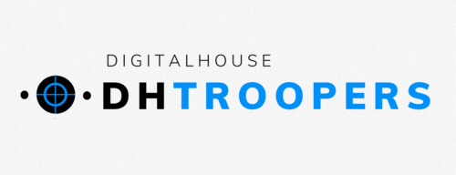

# PeriTroopers.com.ar

Realizamos una retrospectiva de cómo funcionamos como equipo durante el Sprint 5, centrandonos en crecer y mejorar en cara a los próximos desafios, y lo realizamos mediante la dinámica de la **estrella de mar**. Las conclusiones a las que llegamos fueron las siguientes:

##  - Comenzar a hacer -

Tal como mencionamos en las retrospectivas realizadas anteriormente, creemos que a esta altura del proyecto ya nos encontramos cómodos con las metodologías utilizadas, trabajando en equipo, avanzando en conjunto, siempre buscando mejoras u oportunidades que podamos incluir en el recorrido, y elegimos seguir trabajando de esta manera.

## - Más de -

Trabajo en conjunto, reuniones en equipo donde hay espacio para el crecimiento tanto individual como grupal, escuchando todas las opiniones y puntos de vista. Seguir buscando nuevas herramientas para lograr una mejora continua.

## - Continuar haciendo -

Como ya mencionamos anteriormente,  creemos que estamos funcionando muy bien como equipo, con lo cual siempre nos proponemos seguir trabajando así.  
Valoramos incluso que alternamos el cronograma de reuniones para analizar cuando eran mas productivos los encuentros, y gracias a autoconocimiento del grupo podemos determinar en que momentos es preferible avanzar con el desarrollo del sprint y cuando es mejor hacer una pausa para retomar el encuentro con mejores ideas, más energía o con nuevas soluciones.
  
En cuanto a **“Dejar de hacer“ y “Menos de”**, estamos continuamente en diálogo, donde hay lugar para inquietudes y consultas, tanto personales como del equipo, por lo que intentamos no repetir situaciones que sucedieron en el pasado porque hoy tenemos las herramientas para evitar que eso ocurra.
  
  ***   

      
¿Querés ver como trabajamos este Sprint? Visitá [nuestro tablero de Sprint 7](https://trello.com/b/ddauf4ZZ/sprint-7) en Trello.

